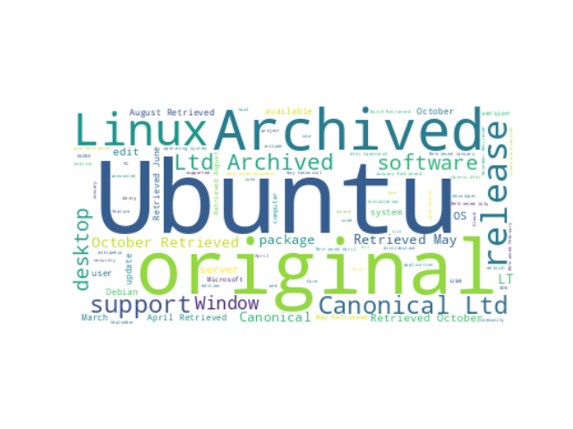

# Word Cloud
Generate a word cloud or tag cloud parsed from text from HTML content from a given web page.

## Setup
```sh
git clone https://github.com/peterklingelhofer/wordcloud.git
cd wordcloud
python --version
pip install requests
pip install bs4
pip install matplotlib
```

## Usage
```sh
python index.py
```

## Sample
